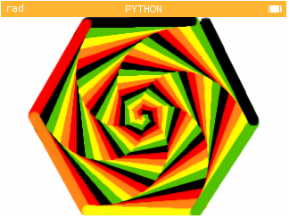

# A markdown page

You can use Markdown here and here nd here



# Auteur : Cyril D., elève de seconde
"""
Réalisé dans le cadre d'un devoir maison "Les mathématiques sont belles"
https://twitter.com/nsi_xyz/status/1380526932543090690
Réutilisé pour le travail "Le Python et la Tortue" en spécialité NSI
"""

```python
import turtle
liste = ["red", "orange", "yellow", "green", "black"]
for i in range(125) :
  turtle.color(liste[i%5])
  turtle.pensize(10+2)
  turtle.forward(i)
  turtle.left(59)
```


  ```python
print("42")
```